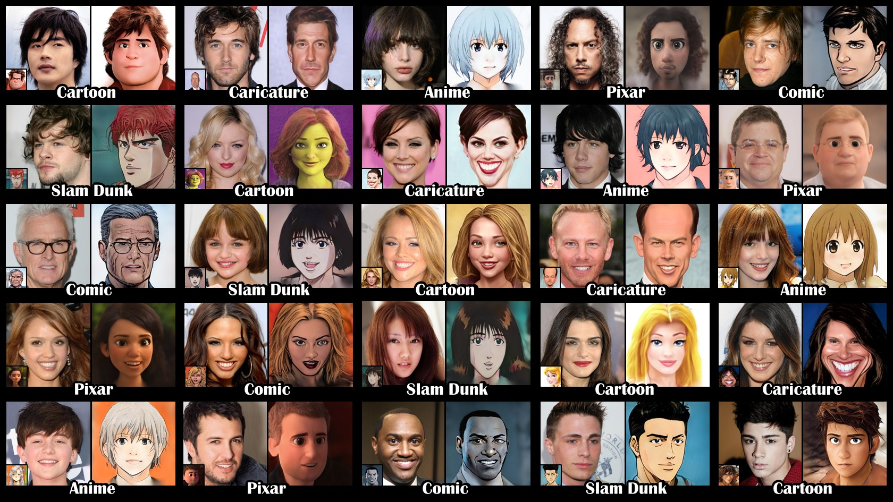
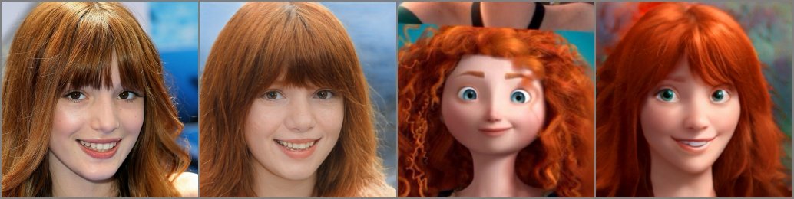
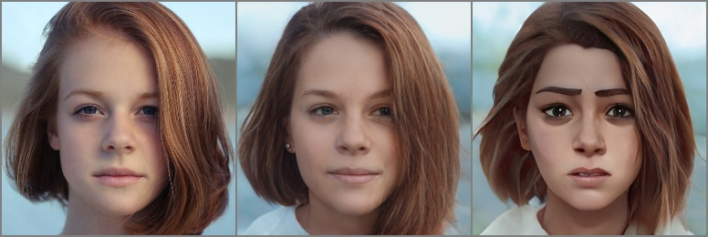

# DualStyleGAN - Official PyTorch Implementation



This repository provides the official PyTorch implementation for the following paper:

**Pastiche Master: Exemplar-Based High-Resolution Portrait Style Transfer**<br>
[Shuai Yang](https://williamyang1991.github.io/), [Liming Jiang](https://liming-jiang.com/), [Ziwei Liu](https://liuziwei7.github.io/) and [Chen Change Loy](https://www.mmlab-ntu.com/person/ccloy/)<br>
In CVPR 2022.<br>
[**Project Page**](https://www.mmlab-ntu.com/project/dualstylegan/) | [**Paper**](https://arxiv.org/abs/2203.13248) | [**Supplementary Video**](https://www.youtube.com/watch?v=scZTu77jixI)
> **Abstract:** *Recent studies on StyleGAN show high performance on artistic portrait generation by transfer learning with limited data. In this paper, we explore more challenging exemplar-based high-resolution portrait style transfer by introducing a novel <b>DualStyleGAN</b> with flexible control of dual styles of the original face domain and the extended artistic portrait domain. Different from StyleGAN, DualStyleGAN provides a natural way of style transfer by characterizing the content and style of a portrait with an <b>intrinsic style path</b> and a new <b>extrinsic style path</b>, respectively. The delicately designed extrinsic style path enables our model to modulate both the color and complex structural styles hierarchically to precisely pastiche the style example. Furthermore, a novel progressive fine-tuning scheme is introduced to smoothly transform the generative space of the model to the target domain, even with the above modifications on the network architecture. Experiments demonstrate the superiority of DualStyleGAN over state-of-the-art methods in high-quality portrait style transfer and flexible style control.*

**Features**:<br> 
**High-Resolution** (1024) | **Training Data-Efficient** (~200 Images) | **Exemplar-Based Color and Structure Transfer**

## Updates

- [03/2022] Paper and supplementary video are released.
- [03/2022] Web demo is created.
- [03/2022] Code is released.
- [03/2022] This website is created.


## Web Demo

Integrated into [Huggingface Spaces 🤗](https://huggingface.co/spaces) using [Gradio](https://github.com/gradio-app/gradio). Try out the Web Demo: [](https://huggingface.co/spaces/hysts/DualStyleGAN)


## Installation
**Clone this repo:**
```bash
git clone https://github.com/williamyang1991/DualStyleGAN.git
cd DualStyleGAN
```
**Dependencies:**

All dependencies for defining the environment are provided in `environment/dualstylegan_env.yaml`.
We recommend running this repository using [Anaconda](https://docs.anaconda.com/anaconda/install/):
```bash
conda env create -f ./environment/dualstylegan_env.yaml
```
We use CUDA 10.1 so it will install PyTorch 1.7.1 (corresponding to [Line 22](https://github.com/williamyang1991/DualStyleGAN/blob/main/environment/dualstylegan_env.yaml#L22), [Line 25](https://github.com/williamyang1991/DualStyleGAN/blob/main/environment/dualstylegan_env.yaml#L25), [Line 26](https://github.com/williamyang1991/DualStyleGAN/blob/main/environment/dualstylegan_env.yaml#L26) of `dualstylegan_env.yaml`). Please install PyTorch that matches your own CUDA version following [https://pytorch.org/](https://pytorch.org/).

## (1) Dataset Preparation

Cartoon, Caricature and Anime datasets can be downloaded from their official pages.
We also provide the script to build new datasets.

| Dataset | Description |
| :--- | :--- |
| [Cartoon](https://mega.nz/file/HslSXS4a#7UBanJTjJqUl_2Z-JmAsreQYiJUKC-8UlZDR0rUsarw) | 317 cartoon face images from [Toonify](https://github.com/justinpinkney/toonify). |
| Caricature | 199 images from [WebCaricature](https://cs.nju.edu.cn/rl/WebCaricature.htm). Please refer to [dataset preparation](./data_preparation/readme.md#caricature-dataset) for more details. |
| Anime | 174 images from [Danbooru Portraits](https://www.gwern.net/Crops#danbooru2019-portraits). Please refer to  [dataset preparation](./data_preparation/readme.md#anime-dataset) for more details. |
| Other styles | Please refer to  [dataset preparation](./data_preparation/readme.md#build-your-own-dataset) for the way of building new datasets. |

<br/>

## (2) Inference for Style Transfer and Artistic Portrait Generation

### Inference Notebook 
<a href="http://colab.research.google.com/github/williamyang1991/DualStyleGAN/blob/master/notebooks/inference_playground.ipynb"></a>  
To help users get started, we provide a Jupyter notebook found in `./notebooks/inference_playground.ipynb` that allows one to visualize the performance of DualStyleGAN.
The notebook will download the necessary pretrained models and run inference on the images found in `./data/`.

If no GPU is available, you may refer to [Inference on CPU](./model/stylegan/op_cpu#readme), and set `device = 'cpu'` in the notebook.

### Pretrained Models

Pretrained models can be downloaded from [Google Drive](https://drive.google.com/drive/folders/1GZQ6Gs5AzJq9lUL-ldIQexi0JYPKNy8b?usp=sharing) or [Baidu Cloud](https://pan.baidu.com/s/1sOpPszHfHSgFsgw47S6aAA ) (access code: cvpr):

| Model | Description |
| :--- | :--- |
| [encoder](https://drive.google.com/file/d/1NgI4mPkboYvYw3MWcdUaQhkr0OWgs9ej/view?usp=sharing) | Pixel2style2pixel encoder that embeds FFHQ images into StyleGAN2 Z+ latent code |
| [cartoon](https://drive.google.com/drive/folders/1xPo8PcbMXzcUyvwe5liJrfbA5yx4OF1j?usp=sharing) | DualStyleGAN and sampling models trained on Cartoon dataset, 317 (refined) extrinsic style codes |
| [caricature](https://drive.google.com/drive/folders/1BwLXWkSyWDApblBPvaHKsRCTqnhiHxUZ?usp=sharing) | DualStyleGAN and sampling models trained on Caricature dataset, 199 (refined) extrinsic style codes |
| [anime](https://drive.google.com/drive/folders/1YvFj33Bfum4YuBeqNNCYLfiBrD4tpzg7?usp=sharing) | DualStyleGAN and sampling models trained on Anime dataset, 174 (refined) extrinsic style codes |
| [arcane](https://drive.google.com/drive/folders/1-MYwaEQthhAJ_ScWVb0LOQiVkKeSzpBm?usp=sharing) | DualStyleGAN and sampling models trained on Arcane dataset, 100 extrinsic style codes |
| [comic](https://drive.google.com/drive/folders/1qC2onFGs2R-XCXRQTP_yyNbY1fT0BdZG?usp=sharing) | DualStyleGAN and sampling models trained on Comic dataset, 101 extrinsic style codes |
| [pixar](https://drive.google.com/drive/folders/1ve4P8Yb4EZ9g_sRy_RCw3N74p46tNpeW?usp=sharing) | DualStyleGAN and sampling models trained on Pixar dataset, 122 extrinsic style codes |
| [slamdunk](https://drive.google.com/drive/folders/1X345yn_YbMEHBcj7K91O-oQZ2YjVpAcI?usp=sharing) | DualStyleGAN and sampling models trained on Slamdunk dataset, 120 extrinsic style codes |

The saved checkpoints are under the following folder structure:
```
checkpoint
|--encoder.pt                     % Pixel2style2pixel model
|--cartoon
    |--generator.pt               % DualStyleGAN model
    |--sampler.pt                 % The extrinsic style code sampling model
    |--exstyle_code.npy           % extrinsic style codes of Cartoon dataset
    |--refined_exstyle_code.npy   % refined extrinsic style codes of Cartoon dataset
|--caricature
    % the same files as in Cartoon
...
```

### Exemplar-Based Style Transfer
Transfer the style of a default Cartoon image onto a default face:
```python
python style_transfer.py 
```
The result `cartoon_transfer_53_081680.jpg` is saved in the folder `.\output\`,
where `53` is the id of the style image in the Cartoon dataset, `081680` is the name of the content face image.
An corresponding overview image `cartoon_transfer_53_081680_overview.jpg` is additionally saved to illustrate the input content image, the encoded content image, the style image (* the style image will be shown only if it is in your folder), and the result: 



Specify the style image with `--style` and `--style_id` (find the mapping between id and filename [here](./data_preparation/id_filename_list.txt), find the visual mapping between id and the style image [here](./doc_images)). Specify the filename of the saved images with `--name`. Specify the weight to adjust the degree of style with `--weight`.
The following script generates the style transfer results in the teaser of the paper. 
```python
python style_transfer.py
python style_transfer.py --style cartoon --style_id 10
python style_transfer.py --style caricature --name caricature_transfer --style_id 0 --weight 1 1 1 1 1 1 1 1 1 1 1 1 1 1 1 1 1 1
python style_transfer.py --style caricature --name caricature_transfer --style_id 187 --weight 1 1 1 1 1 1 1 1 1 1 1 1 1 1 1 1 1 1
python style_transfer.py --style anime --name anime_transfer --style_id 17 --weight 0 0 0 0 0.75 0.75 0.75 1 1 1 1 1 1 1 1 1 1 1
python style_transfer.py --style anime --name anime_transfer --style_id 48 --weight 0 0 0 0 0.75 0.75 0.75 1 1 1 1 1 1 1 1 1 1 1
```

Specify the content image with `--content`. If the content image is not well aligned with FFHQ, use `--align_face`. For preserving the color style of the content image, use `--preserve_color` or set the last 11 elements of `--weight` to all zeros.
```python
python style_transfer.py --content ./data/content/unsplash-rDEOVtE7vOs.jpg --align_face --preserve_color \
       --style arcane --name arcane_transfer --style_id 13 \
       --weight 0.6 0.6 0.6 0.6 0.6 0.6 0.6 0.6 0.6 0.6 0.6 1 1 1 1 1 1 1 
```

 → 

More options can be found via `python style_transfer.py  -h`.


**Remarks**: Our trained pSp encoder on Z+ space cannot perfectly encode the content image. If the style transfer result more consistent with the content image is desired, one may use latent optimization to better fit the content image or using other StyleGAN encoders.

### Artistic Portrait Generation
Generate random Cartoon face images (Results are saved in the `./output/` folder):
```python
python generate.py 
```

Specify the style type with `--style` and the filename of the saved images with `--name`:
```python
python generate.py --style arcane --name arcane_generate
```

Specify the weight to adjust the degree of style with `--weight`.

Keep the intrinsic style code, extrinsic color code or extrinsic structure code fixed using `--fix_content`, `--fix_color` and `--fix_structure`, respectively.
```python
python generate.py --style caricature --name caricature_generate --weight 1 1 1 1 1 1 1 1 1 1 1 1 1 1 1 1 1 1 --fix_content
```

More options can be found via `python generate.py -h`.

<br/>

## (3) Training DualStyleGAN

Download the supporting models to the `./checkpoint/` folder:

| Model | Description |
| :--- | :--- |
| [stylegan2-ffhq-config-f.pt](https://drive.google.com/file/d/1EM87UquaoQmk17Q8d5kYIAHqu0dkYqdT/view) | StyleGAN model trained on FFHQ taken from [rosinality](https://github.com/rosinality/stylegan2-pytorch). |
| [model_ir_se50.pth](https://drive.google.com/file/d/1KW7bjndL3QG3sxBbZxreGHigcCCpsDgn/view?usp=sharing) | Pretrained IR-SE50 model taken from [TreB1eN](https://github.com/TreB1eN/InsightFace_Pytorch) for ID loss. |

### Facial Destylization

**Step 1: Prepare data.** Prepare the dataset in `./data/DATASET_NAME/images/train/`. First create lmdb datasets:
```python
python ./model/stylegan/prepare_data.py --out LMDB_PATH --n_worker N_WORKER --size SIZE1,SIZE2,SIZE3,... DATASET_PATH
```
For example, download 317 Cartoon images into `./data/cartoon/images/train/` and run 
> python ./model/stylegan/prepare_data.py --out ./data/cartoon/lmdb/ --n_worker 4 --size 1024 ./data/cartoon/images/

**Step 2: Fine-tune StyleGAN.** Fine-tune StyleGAN in distributed settings:
```python
python -m torch.distributed.launch --nproc_per_node=N_GPU --master_port=PORT finetune_stylegan.py --batch BATCH_SIZE \
       --ckpt FFHQ_MODEL_PATH --iter ITERATIONS --style DATASET_NAME --augment LMDB_PATH
```
Take the cartoon dataset for example, run (batch size of 8\*4=32 is recommended)
> python -m torch.distributed.launch --nproc_per_node=8 --master_port=8765 finetune_stylegan.py --iter 600
                          --batch 4 --ckpt ./checkpoint/stylegan2-ffhq-config-f.pt --style cartoon
                          --augment ./data/cartoon/lmdb/

The fine-tuned model can be found in `./checkpoint/cartoon/finetune-000600.pt`. Intermediate results are saved in `./log/cartoon/`.

**Step 3: Destylize artistic portraits.** 
```python
python destylize.py --model_name FINETUNED_MODEL_NAME --batch BATCH_SIZE --iter ITERATIONS DATASET_NAME
```
Take the cartoon dataset for example, run:
> python destylize.py --model_name fintune-000600.pt --batch 1 --iter 300 cartoon

The intrinsic and extrinsic style codes are saved in `./checkpoint/cartoon/instyle_code.npy` and `./checkpoint/cartoon/exstyle_code.npy`, respectively. Intermediate results are saved in `./log/cartoon/destylization/`.
To speed up destylization, set `--batch` to large value like 16. 
For styles severely different from real faces, set `--truncation` to small value like 0.5 to make the results more photo-realistic (it enables DualStyleGAN to learn larger structrue deformations).


### Progressive Fine-Tuning 

**Stage 1 & 2: Pretrain DualStyleGAN on FFHQ.** 
We provide our pretrained model [generator-pretrain.pt](https://drive.google.com/file/d/1j8sIvQZYW5rZ0v1SDMn2VEJFqfRjMW3f/view?usp=sharing) at [Google Drive](https://drive.google.com/drive/folders/1GZQ6Gs5AzJq9lUL-ldIQexi0JYPKNy8b?usp=sharing) or [Baidu Cloud](https://pan.baidu.com/s/1sOpPszHfHSgFsgw47S6aAA ) (access code: cvpr). This model is obtained by:
> python -m torch.distributed.launch --nproc_per_node=1 --master_port=8765 pretrain_dualstylegan.py --iter 3000
                          --batch 4 ./data/ffhq/lmdb/

where `./data/ffhq/lmdb/` contains the lmdb data created from the FFHQ dataset via `./model/stylegan/prepare_data.py`.

**Stage 3: Fine-Tune DualStyleGAN on Target Domain.** Fine-tune DualStyleGAN in distributed settings:
```python
python -m torch.distributed.launch --nproc_per_node=N_GPU --master_port=PORT finetune_dualstylegan.py --iter ITERATIONS \ 
                          --batch BATCH_SIZE --ckpt PRETRAINED_MODEL_PATH --augment DATASET_NAME
```
The loss term weights can be specified by `--style_loss` (λ<sub>FM</sub>), `--CX_loss` (λ<sub>CX</sub>), `--perc_loss` (λ<sub>perc</sub>), `--id_loss` (λ<sub>ID</sub>) and `--L2_reg_loss` (λ<sub>reg</sub>). λ<sub>ID</sub> and λ<sub>reg</sub> are suggested to be tuned for each style dataset to achieve ideal performance. More options can be found via `python finetune_dualstylegan.py -h`.

Take the Cartoon dataset as an example, run (multi-GPU enables a large batch size of 8\*4=32 for better performance):
> python -m torch.distributed.launch --nproc_per_node=8 --master_port=8765 finetune_dualstylegan.py --iter 1500 --batch 4 --ckpt ./checkpoint/generator-pretrain.pt 
--style_loss 0.25 --CX_loss 0.25 --perc_loss 1 --id_loss 1 --L2_reg_loss 0.015 --augment cartoon

The fine-tuned models can be found in `./checkpoint/cartoon/generator-ITER.pt` where ITER = 001000, 001100, ..., 001500. Intermediate results are saved in `./log/cartoon/`. Large ITER has strong cartoon styles but at the cost of artifacts, and users may select the most balanced one from 1000-1500. We use 1400 for our paper experiments.

### (optional) Latent Optimization and Sampling

**Refine extrinsic style code.** Refine the color and structure styles to better fit the example style images.
```python 
python refine_exstyle.py --lr_color COLOR_LEARNING_RATE --lr_structure STRUCTURE_LEARNING_RATE DATASET_NAME
```
By default, the code will load `instyle_code.npy`, `exstyle_code.npy`, and `generator.pt` in `./checkpoint/DATASET_NAME/`. Use `--instyle_path`, `--exstyle_path`, `--ckpt` to specify other saved style codes or models. Take the Cartoon dataset as an example, run:
> python refine_exstyle.py --lr_color 0.1 --lr_structure 0.005 --ckpt ./checkpoint/cartoon/generator-001400.pt cartoon

The refined extrinsic style codes are saved in `./checkpoint/DATASET_NAME/refined_exstyle_code.npy`. `lr_color` and `lr_structure` are suggested to be tuned to better fit the example styles.

**Training sampling network.** Train a sampling network to map unit Gaussian noises to the distribution of extrinsic style codes:
```python
python train_sampler.py DATASET_NAME
```
By default, the code will load `refined_exstyle_code.npy` or `exstyle_code.npy` in `./checkpoint/DATASET_NAME/`. Use `--exstyle_path` to specify other saved extrinsic style codes. The saved model can be found in `./checkpoint/DATASET_NAME/sampler.pt`.

<br/>

## (4) Results

#### Exemplar-based cartoon style trasnfer

https://user-images.githubusercontent.com/18130694/158047991-77c31137-c077-415e-bae2-865ed3ec021f.mp4

#### Exemplar-based caricature style trasnfer

https://user-images.githubusercontent.com/18130694/158048107-7b0aa439-5e3a-45a9-be0e-91ded50e9136.mp4

#### Exemplar-based anime style trasnfer

https://user-images.githubusercontent.com/18130694/158048114-237b8b81-eff3-4033-89f4-6e8a7bbf67f7.mp4

#### Other styles


## Citation

If you find this work useful for your research, please consider citing our paper:

```bibtex
@inproceedings{yang2022Pastiche,
  title={Pastiche Master: Exemplar-Based High-Resolution Portrait Style Transfer},
  author={Yang, Shuai and Jiang, Liming and Liu, Ziwei and Loy, Chen Change},
  booktitle={CVPR},
  year={2022}
}
```

## Acknowledgments

The code is mainly developed based on [stylegan2-pytorch](https://github.com/rosinality/stylegan2-pytorch) and [pixel2style2pixel](https://github.com/eladrich/pixel2style2pixel).
